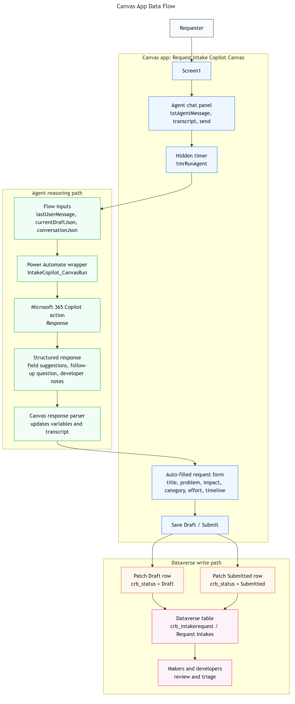
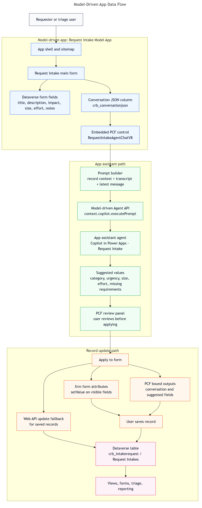
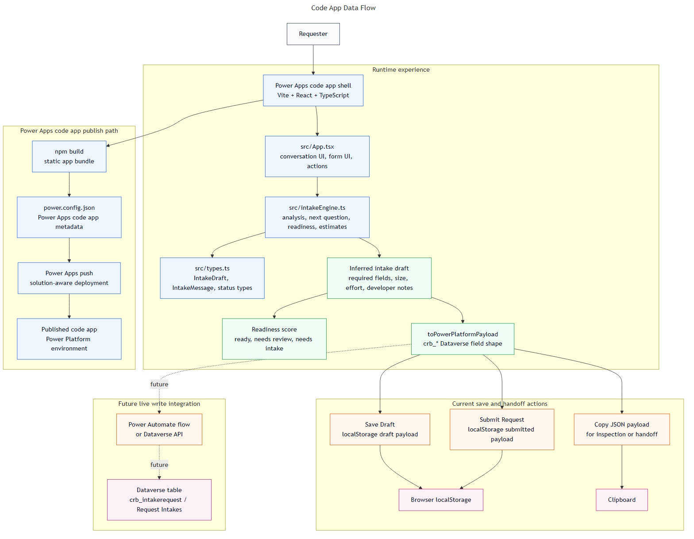

# Solution Data Flow Diagrams

These diagrams show how the request intake solution is split across three Power Platform experiences:

- Canvas app: the maker-built intake form with an agent chat panel.
- Model-driven app: the Dataverse-centered intake form with an embedded PCF agent chat control.
- Code app: the React and TypeScript implementation that produces Dataverse-shaped request payloads.

## Canvas App

The Canvas app is the main citizen-developer intake experience. It collects a request through a chat-style interface, calls the Canvas wrapper flow for agent reasoning, fills visible form fields, and saves or submits rows to the Dataverse `Request Intakes` table.

Visual files: [PNG](./visuals/canvas-app-data-flow.png), [SVG](./visuals/canvas-app-data-flow.svg), [Mermaid source](./visuals/canvas-app-data-flow.mmd).

### Canvas Data Flow

1. The requester describes the issue in the agent chat box.
2. Canvas sends the latest message, current draft JSON, and conversation JSON to `IntakeCopilot_CanvasRun`.
3. The wrapper flow calls the Microsoft 365 Copilot response action and returns a structured response.
4. Canvas formulas parse the response and update visible form variables and controls.
5. `Save Draft` or `Submit` patches the Dataverse `Request Intakes` row with `crb_status` set to `Draft` or `Submitted`.

## Model-Driven App

The model-driven app is the Dataverse-first experience. The request form owns the record, and the PCF control acts as the embedded agent chat surface. The active control is `cr3d3_WorkManagement.RequestIntakeAgentChatV8`.

Visual files: [PNG](./visuals/model-driven-app-data-flow.png), [SVG](./visuals/model-driven-app-data-flow.svg), [Mermaid source](./visuals/model-driven-app-data-flow.mmd).

### Model-Driven Data Flow

1. The user opens or creates a `Request Intake` record in the model-driven app.
2. The embedded PCF chat control builds a prompt from the record, transcript, and latest message.
3. The control calls the model-driven Agent API, which uses the app assistant agent.
4. The response is shown as reviewed suggestions rather than blindly overwriting the record.
5. `Apply to form` updates visible form fields and bound outputs; the user then saves the Dataverse record.

## Code App

The code app is the React and TypeScript version of the intake experience. It currently runs the intake reasoning locally in `src/intakeEngine.ts`, stages draft and submitted payloads in browser storage, and produces a Dataverse-friendly JSON shape for a future direct flow or Dataverse write.

Visual files: [PNG](./visuals/code-app-data-flow.png), [SVG](./visuals/code-app-data-flow.svg), [Mermaid source](./visuals/code-app-data-flow.mmd).

### Code App Data Flow

1. The requester chats with the React UI in `src/App.tsx`.
2. `src/intakeEngine.ts` infers category, urgency, size, effort, missing requirements, readiness, and developer notes.
3. `toPowerPlatformPayload` maps the draft into `crb_*` fields that match the Dataverse request table.
4. Save and submit actions currently stage payloads in browser `localStorage`; copy JSON supports inspection and handoff.
5. The published code app path builds the React bundle and pushes it to the Power Platform solution.

## Shared Data Contract

All three experiences converge on the same Dataverse-oriented request shape:

- `crb_title`
- `crb_description`
- `crb_category`
- `crb_affectedarea`
- `crb_usersaffected`
- `crb_businessimpact`
- `crb_urgency`
- `crb_desiredoutcome`
- `crb_constraints`
- `crb_dependencies`
- `crb_acceptancecriteria`
- `crb_size`
- `crb_estimatedeffort`
- `crb_estimatedduration`
- `crb_confidence`
- `crb_missingrequirements`
- `crb_additionalinformation`
- `crb_conversationjson`
- `crb_status`

That shared contract is the architectural anchor: each app can have a different user experience, but the request data lands in a consistent structure for triage, reporting, automation, and developer handoff.
