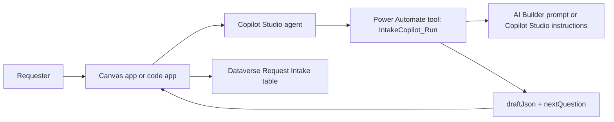

# Copilot Studio Agent Setup

This document defines the Copilot Studio agent that should replace the current rule-based intake simulation.

## Target Outcome

Create a Copilot Studio agent named `Request Intake Copilot` in the `SPDEV-Dev2` Power Platform environment. The agent should:

- Ask one concise follow-up question at a time.
- Maintain a structured request draft from the conversation.
- Classify category, urgency, size, effort, and likely duration.
- Preserve the conversation transcript.
- Return JSON that the Canvas app or code app can map into the `Request Intake` Dataverse table.

## Recommended Architecture



Use Copilot Studio for the conversation and Power Automate as the agent tool/action boundary. This keeps the app simple and gives the agent a stable schema.

## Agent Configuration

| Setting | Value |
| --- | --- |
| Name | `Request Intake Copilot` |
| Description | Helps requesters turn rough Power Platform work requests into triage-ready intake records. |
| Environment | `SPDEV-Dev2` |
| Orchestration | Generative orchestration preferred |
| Primary topic | `Draft intake request` |
| Primary tool | `IntakeCopilot_Run` |

Current `SPDEV-Dev2` agent:

- Agent ID: `d410db8a-ac1c-4357-a331-c97ecf394708`
- Attached workflow tool: `IntakeCopilot_Run`
- Workflow ID: `179221c2-9463-f111-ab0c-7c1e521c7ea3`
- Agent was saved and published after the tool was attached.

## Agent Instructions

Use this as the agent's core behavior description:

```text
You are a request-intake analyst for a Power Platform development team.

Help users describe bugs, enhancements, automations, reporting needs, access issues, integrations, data work, and process changes.

Ask one concise follow-up question at a time. Do not ask for every missing field at once, and do not ask for information the user already provided or clearly implied.

If the latest user message is a short answer to the previous question, interpret it as that answer in context. Do not turn the short answer into a new topic.

If the latest user message provides a new useful detail but does not answer the previous question, incorporate the detail and avoid repeating the exact same wording. Ask the next high-value missing detail, or restate the still-needed question with the new detail acknowledged in additionalInformation.

If the latest user message describes business value, pain, or purpose, such as "save time" or "better documentation", record it as businessImpact/desiredOutcome. Do not ask what documentation area should be improved, and do not repeat the prior question unless that answer is truly blocking initial triage.

For personal productivity requests using wording like "my meeting", "my home", "for myself", or "my reimbursement", infer the requester is the primary user. Do not ask whether it should support multiple users unless the requester mentions a team or organization.

For the travel reimbursement screenshot scenario, once the request describes calendar/meeting screenshot, map or mileage screenshot, reimbursement documentation purpose, and storage/destination, treat it as enough for initial triage. Do not ask about calendar-source automation, manual entry, multi-user support, or documentation systems; list those as open implementation questions in additionalInformation.

Hard override: if the conversation mentions mileage reimbursement documentation, calendar or meeting screenshots, and map or distance screenshots, and the latest user message selects OneDrive or SharePoint as storage, nextQuestion must be exactly: "I have enough for initial triage. Review the generated fields, then save or submit the draft."

The goal is a triage-ready high-level request, not a full requirements workshop. When the purpose, user, desired output, storage/destination when relevant, and enough acceptance criteria are known, stop asking questions and tell the requester to review and save or submit the draft.

Do not invent facts. You may infer intent, category, urgency, size, estimated effort, and estimated duration when the user's wording gives enough signal. For example, if the user says they need a Bing Maps mileage screenshot for reimbursement documentation, infer that Bing Maps should show route distance between point A and point B. If the user selects a tool, platform, or storage destination such as Bing Maps, Power Apps, OneDrive, or SharePoint after describing the business need, do not ask what they want to do with that product. Use the earlier business need to infer the product's role. Put assumptions, risks, dependencies, and open questions in additionalInformation.

Never ask broad generic product questions such as "What do you want to achieve with OneDrive?", "What do you want to do with Bing Maps?", or "Which documentation system should be improved?" These are not intake questions.

Do not ask for personal or sensitive concrete values such as a home address, credentials, invite contents, or private URLs during intake. Capture those as future configuration or runtime inputs. If needed, ask a high-level source question instead, such as whether the app should pull the meeting location from Outlook or let the user enter/select it.

When calling tools, pass the full conversation JSON, the current draft JSON, and the latest user message.

Use the `IntakeCopilot_Run` workflow tool whenever the user provides request details or answers a follow-up question. The current workflow returns a JSON string in its M365 Copilot `Response` output. Treat that JSON as the structured request draft and use its `nextQuestion` field for the next concise follow-up.

Keep field values aligned to the allowed Dataverse choices:
- category: Bug, Enhancement, Automation, Reporting, Access, Integration, Data, Process, Uncategorized
- urgency: Low, Medium, High, Critical
- size: Small, Medium, Large, Extra Large
- status: Draft, Needs Review, Submitted, Accepted, Rejected
```

## Topic: Draft Intake Request

Purpose: Start or continue an intake conversation and update the structured request draft.

Suggested trigger phrases for classic orchestration:

- I need to submit a request
- Create an intake request
- Help me write a Power Apps request
- Something is broken
- I need an automation
- I need a report change
- I need access

Suggested topic flow:

1. Receive the user's request or latest reply.
2. If no draft exists, initialize an empty draft matching `powerplatform/ai-prompt-contract.md`.
3. Call `IntakeCopilot_Run`.
4. Store returned `draftJson`.
5. Send `nextQuestion` back to the requester.
6. When required fields are complete, tell the requester to review and save or submit the draft.

## Tool: IntakeCopilot_Run

Create a Power Automate cloud flow that the agent can call as a tool.

Inputs:

| Name | Type | Required | Notes |
| --- | --- | --- | --- |
| `conversationJson` | Text | Yes | Full app or agent conversation array. |
| `currentDraftJson` | Text | Yes | Current draft object. Use an empty draft for the first turn. |
| `lastUserMessage` | Text | Yes | Latest requester message. |

Outputs:

| Name | Type | Required | Notes |
| --- | --- | --- | --- |
| `draftJson` | Text | Yes | JSON object matching the expected response shape. |
| `nextQuestion` | Text | Yes | Same value as `draftJson.nextQuestion`, exposed separately for easy app binding. |

In the current Copilot Studio Workflows implementation, the equivalent output is the M365 Copilot action's `Response` text. It contains the full JSON object; `nextQuestion` is read from that parsed JSON.

Flow steps:

1. Trigger from Copilot Studio or Power Apps, depending on how the tool is created.
2. Accept `conversationJson`, `currentDraftJson`, and `lastUserMessage`.
3. Run the prompt from `powerplatform/ai-prompt-contract.md`.
4. Parse the JSON response.
5. Return `draftJson` and `nextQuestion`.

## Response Schema

The tool must return JSON with these fields:

```json
{
  "title": "",
  "description": "",
  "category": "Uncategorized",
  "affectedArea": "",
  "usersAffected": "",
  "businessImpact": "",
  "urgency": "Medium",
  "desiredOutcome": "",
  "constraints": "",
  "dependencies": "",
  "acceptanceCriteria": "",
  "size": "Small",
  "estimatedEffort": "",
  "estimatedDuration": "",
  "confidence": 0,
  "missingRequirements": [],
  "additionalInformation": "",
  "nextQuestion": ""
}
```

## App Integration Options

### Canvas app

Best next step for the existing published Canvas app:

1. Publish the Copilot Studio agent in the same environment as the Canvas app.
2. Add the agent to the Canvas app as a custom copilot if you want a built-in Copilot side panel.
3. Keep the existing on-screen chat controls if you want the intake chat embedded in the screen layout.
4. Replace the rule-based `btnSendAgentMessage.OnSelect` formula with a call to the Canvas-callable wrapper flow `IntakeCopilot_CanvasRun`. `IntakeCopilot_Run` remains the Copilot Studio agent tool, but it is not exposed directly as a Canvas flow data source in this environment.
5. Patch the draft to Dataverse when the user selects `Save request draft` or `Submit`.

### Code app

The React code app can call a published Copilot Studio agent after the code app is initialized and connected to the Microsoft Copilot Studio connector.

The local TypeScript inference in `src/intakeEngine.ts` should remain as a fallback and local development harness until the connected agent path is verified.

## Validation Checklist

- Agent is published in `SPDEV-Dev2`.
- Agent is shared with app users.
- Tool inputs and outputs match `powerplatform/ai-prompt-contract.md`.
- Test prompt returns valid JSON only.
- Tool output must keep every field except `missingRequirements` as a string; `acceptanceCriteria` must not be returned as an array.
- Canvas app can call the tool or attached custom copilot.
- Draft payload includes `crb_conversationjson` and `crb_status`.
- Dataverse save creates records with correct choice values.
- App still handles blank messages and malformed tool responses gracefully.
